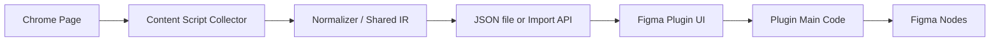

# Web to Figma Guide

This repo is starting from zero. The right way to build this is not "send raw HTML into Figma." The right way is:

1. Extract the live browser page into a shared intermediate representation.
2. Normalize layout, styles, assets, and text into your own schema.
3. Rebuild that schema inside a Figma plugin.

If you want something close to `html.to.design`, build it as a hybrid system:

- Native editable Figma nodes for simple boxes, text, images, and straightforward flex layouts.
- Raster screenshot fallbacks for unsupported or very hard browser features.

Trying to make every HTML/CSS feature 100% editable inside Figma will slow the project down badly.

## 1. What You Are Actually Building

You need four pieces:

1. `apps/extension`: Chrome extension that inspects the active tab and extracts a page model.
2. `packages/shared`: Shared TypeScript types, validators, and mappers for the intermediate representation.
3. `apps/figma-plugin`: Figma plugin that reads the page model and renders Figma nodes.
4. `services/import-api` optional: Backend used to store imports and assets so the extension and plugin can share them.

For the first MVP, skip the backend and use a JSON file handoff:

- Chrome extension: "Export to JSON"
- Figma plugin: "Import JSON"

That gets you working faster and proves the hard part first: capture plus rendering.

## 2. System Architecture



Recommended production flow:

1. User opens a website in Chrome.
2. Extension injects a collector into the tab.
3. Collector reads DOM, computed styles, bounds, assets, and optional screenshots.
4. Collector converts everything into your shared scene schema.
5. Extension uploads the scene to your backend and gets an `importId`.
6. User opens the Figma plugin and pastes or selects that `importId`.
7. Plugin fetches the scene and recreates it on the canvas.

## 3. Why a Shared Intermediate Representation Matters

Do not tie the Figma plugin directly to browser DOM APIs. Keep a clean schema between both sides.

Your schema should represent:

- Page metadata
- Viewport size
- Frames and groups
- Text runs
- Images
- SVG or vector placeholders
- Layout data
- Visual style data
- Asset references
- Fallback raster blocks

Example shape:

```ts
export type Scene = {
  version: 1;
  sourceUrl: string;
  title: string;
  viewport: { width: number; height: number };
  nodes: SceneNode[];
  assets: Record<string, Asset>;
};

export type SceneNode =
  | FrameNodeIR
  | TextNodeIR
  | ImageNodeIR
  | SvgNodeIR
  | RasterFallbackNodeIR;

export type BaseNodeIR = {
  id: string;
  name: string;
  parentId: string | null;
  x: number;
  y: number;
  width: number;
  height: number;
  rotation: number;
  opacity: number;
  visible: boolean;
  clipsContent?: boolean;
  layout?: LayoutIR;
  style?: StyleIR;
};
```

This schema becomes the contract for the whole product.

## 4. Chrome Extension: What It Must Do

Build the extension as Manifest V3. The official Chrome docs currently point to MV3, `chrome.scripting`, and permissions like `activeTab` for runtime injection. `chrome.tabs.captureVisibleTab()` is still available, but it only captures the visible area and Chrome documents a max rate of 2 calls per second. If you need deeper page inspection, `chrome.debugger` can talk to Chrome DevTools Protocol domains like `DOMSnapshot` and `Page`.

Practical extension parts:

1. `manifest.json`
2. Background service worker
3. Popup or sidepanel UI
4. Content script collector
5. Optional CDP capture layer through `chrome.debugger`

Minimal permissions for early development:

- `activeTab`
- `scripting`
- `tabs`
- `storage`

Permissions you may add later:

- `debugger`
- `downloads`

### Capture Strategy

Start with a content script first. It is simpler than CDP and enough for the MVP.

The content script should:

1. Walk the visible DOM tree.
2. Ignore hidden nodes.
3. Read `getBoundingClientRect()` for geometry.
4. Read a whitelist of computed styles from `getComputedStyle`.
5. Capture text nodes and text runs.
6. Resolve image sources and background images.
7. Capture pseudo-elements when they materially affect visuals.
8. Build a stacking and paint order model.
9. Return a normalized scene tree.

Important data to capture per element:

- Tag name
- Role or semantic hint
- Bounding box
- Scroll offsets
- `display`, `position`, `z-index`
- Background color and background image
- Border, radius, shadow
- Opacity
- Transform
- Overflow clipping
- Typography
- Text alignment and decoration
- Flex properties
- Grid properties
- Gap, padding, margin
- Object fit and object position

### When to Add CDP

Add `chrome.debugger` plus CDP after the content script MVP is working.

Use it when you need:

- Better layout snapshots with `DOMSnapshot.captureSnapshot`
- Better frame handling
- Full page screenshots via Page domain methods
- Network response inspection for difficult assets

My recommendation:

- MVP: content script only
- V2: content script plus CDP for screenshots and tricky nodes

### Capture Rules That Save Time

Do not try to import every DOM node. Many HTML nodes are structurally meaningless for design output.

Collapse or skip nodes that are:

- Empty wrappers
- Invisible
- Zero-sized
- Purely semantic containers
- Replaced by richer child nodes

Preserve nodes that visually matter:

- Text blocks
- Buttons
- Cards
- Icons
- Images
- Inputs
- Containers with visible background, border, radius, shadow, or clipping

## 5. Rendering Strategy in Figma

The Figma plugin should do one job: take your scene model and rebuild it into Figma nodes.

Do not use the Figma REST API for this import workflow. Use the Plugin API. The REST API is for external app integration, file access, and account-level workflows, not for drawing live nodes inside the current canvas.

Recommended plugin structure:

- `main.ts`: Plugin runtime with access to `figma.*`
- `ui.tsx` or `ui.html`: Import UI, progress, settings, and logs
- `renderer/`: Scene-to-Figma mapping
- `fonts/`: Font mapping and fallback logic
- `assets/`: Image fetching and caching helpers

### Plugin Workflow

1. Open plugin UI with `figma.showUI(...)`.
2. User loads JSON or enters an import ID.
3. UI posts scene data to plugin main code.
4. Main code renders nodes in batches.
5. Plugin groups the result under one page frame.
6. Plugin selects the imported frame and centers the viewport.

### Figma Manifest Notes

Current Figma docs confirm these points:

- Every plugin needs a `manifest.json`.
- New plugins should include `documentAccess: "dynamic-page"`.
- If the plugin fetches remote data or images, you must declare `networkAccess.allowedDomains`.
- `devAllowedDomains` exists for local development hosts.

### Rendering Rules

Render with absolute positioning first. That is the easiest way to get a visual match.

Then selectively upgrade some containers into Auto Layout when the source node is clearly:

- `display: flex`
- one-dimensional
- non-overlapping
- not heavily transformed
- not dependent on complex browser sizing behavior

This order matters:

1. Accurate pixels first
2. Editable structure second
3. Smart cleanup third

If you start with "clean Figma structure," fidelity drops fast.

## 6. Browser CSS to Figma Mapping

This is the core translation problem.

Reasonable first-pass mapping:

- `div`, `section`, `header`, `footer`, `main`, `article` -> `FrameNode`
- Text-bearing elements -> `TextNode`
- `img` -> rectangle or frame with image fill
- Simple SVG -> vector or image fallback
- Border radius -> corner radius
- Background color -> solid fill
- Linear gradients -> gradient fill when simple
- Box shadow -> drop shadow effect when possible
- `overflow: hidden` -> clip content
- `opacity` -> node opacity
- `display: flex` -> Auto Layout when safe
- Complex transforms -> absolute positioning or raster fallback

Hard areas:

- CSS grid
- filters and backdrop filters
- mix-blend-mode
- complex transforms
- sticky and fixed behavior
- pseudo-elements
- masks
- videos
- canvas
- iframes
- web fonts not installed in Figma

For those, use one of two strategies:

1. Approximate with native Figma nodes.
2. Rasterize the subtree and place it as an image.

## 7. The Hybrid Fidelity Strategy

If you want "exact like the site," you need a hybrid renderer.

Use native editable nodes for:

- simple containers
- text
- images
- icons
- common flex layouts
- buttons
- cards

Use screenshot fallback for:

- complex hero sections
- charts
- canvases
- map widgets
- ads
- videos
- filters
- anything with browser-only rendering behavior

This is how you keep the output both useful and believable.

## 8. Text and Font Handling

Text is harder than boxes.

You need to capture:

- font family
- font weight
- font size
- line height
- letter spacing
- text transform
- color
- alignment
- decoration
- white-space behavior

On the Figma side:

1. Map browser fonts to installed Figma fonts.
2. Load the font before assigning characters.
3. Split rich text into styled ranges when needed.
4. Warn when the exact font is unavailable.

Do not block the whole import because one font is missing. Substitute and log it.

## 9. Assets and Images

You need an asset pipeline from day one.

Recommended approach:

1. During capture, assign each external asset an `assetId`.
2. Store its original URL, MIME type, dimensions, and optional bytes or checksum.
3. For the MVP, allow remote URL fetch.
4. For the product version, proxy assets through your backend.

Why proxy assets later:

- fewer CORS problems
- fewer auth and cookie problems
- more stable imports
- easier deduplication

For the plugin:

- fetch image bytes
- create a Figma image from bytes
- apply the image as a fill

## 10. Suggested MVP Scope

Build this first and nothing more:

1. Single page import from the active tab
2. Content script DOM walk
3. Basic boxes, text, and images
4. Simple flex row and column containers
5. Border radius, background, border, shadow, opacity
6. One root page frame in Figma
7. Manual JSON export from Chrome
8. Manual JSON import in Figma

If this works well, then add:

1. Background images
2. SVG support
3. Screenshot fallback blocks
4. Backend handoff by import ID
5. CDP snapshot support
6. Better text styling and font mapping
7. Grid heuristics

## 11. Suggested Repository Layout

```text
apps/
  extension/
    src/
      background/
      content/
      popup/
    manifest.json
  figma-plugin/
    src/
      main/
      ui/
      renderer/
      fonts/
      assets/
    manifest.json
packages/
  shared/
    src/
      schema.ts
      validators.ts
      css-mappers.ts
services/
  import-api/
    src/
```

## 12. Build Order I Recommend

### Phase 1: JSON Roundtrip

Goal: prove capture and render.

Build:

- Extension button: capture active page
- Export scene JSON
- Figma plugin: import JSON
- Renderer for frames, text, images

Do not build auth, accounts, sync, or teams yet.

### Phase 2: Better Fidelity

Goal: improve visual match.

Build:

- text ranges
- gradients
- background images
- better border and shadow mapping
- pseudo-elements
- screenshot fallback blocks

### Phase 3: Product Handoff

Goal: remove the manual JSON step.

Build:

- import API
- asset storage
- import history
- import status
- plugin fetch by import ID

### Phase 4: Advanced Capture

Goal: handle hard pages.

Build:

- CDP snapshots
- better iframe handling
- full page screenshot stitching
- network-based asset recovery
- heuristics for grid and transforms

## 13. Biggest Risks

These are the real risks, not the UI:

1. Browser layout does not map cleanly to Figma layout.
2. Text metrics will differ between browser and Figma.
3. Complex CSS effects are expensive to reproduce.
4. Authenticated assets can break imports.
5. Cross-origin frames are difficult.
6. Exact fidelity and editability pull in opposite directions.

If you manage those six well, the product is viable.

## 14. Recommended First Milestone

If I were building this from scratch, I would aim for this exact milestone:

1. Chrome extension captures the current viewport.
2. It serializes only visible nodes.
3. It supports text, rectangles, images, radius, border, shadow, and opacity.
4. It exports one `scene.json`.
5. Figma plugin imports `scene.json`.
6. Plugin creates one root frame and renders children with absolute positions.

That is small enough to finish and large enough to validate the product.

## 15. Official Docs Worth Following

Chrome:

- [Chrome extensions get started](https://developer.chrome.com/docs/extensions/get-started)
- [Manifest V3 hello world](https://developer.chrome.com/docs/extensions/get-started/tutorial/hello-world)
- [chrome.scripting](https://developer.chrome.com/docs/extensions/reference/api/scripting)
- [chrome.tabs.captureVisibleTab](https://developer.chrome.com/docs/extensions/reference/api/tabs)
- [chrome.debugger](https://developer.chrome.com/docs/extensions/reference/api/debugger)
- [Chrome DevTools Protocol: DOMSnapshot](https://chromedevtools.github.io/devtools-protocol/tot/DOMSnapshot/)
- [Chrome DevTools Protocol: Page](https://chromedevtools.github.io/devtools-protocol/tot/Page/)

Figma:

- [Plugin manifest](https://developers.figma.com/docs/plugins/manifest/)
- [Making network requests](https://developers.figma.com/docs/plugins/making-network-requests/)
- [Figma developer docs](https://developers.figma.com/)
- [Figma REST API intro](https://developers.figma.com/docs/rest-api/)

Checked against current docs on March 2, 2026.

## 16. Direct Recommendation

Do this as two separate apps with one shared schema.

Do not start with:

- direct extension-to-plugin communication
- perfect auto layout conversion
- full CSS support
- multi-page crawl
- team accounts

Start with:

1. JSON export from Chrome
2. JSON import in Figma
3. High-quality scene schema
4. Hybrid native plus raster rendering

That is the shortest path to a real product.
